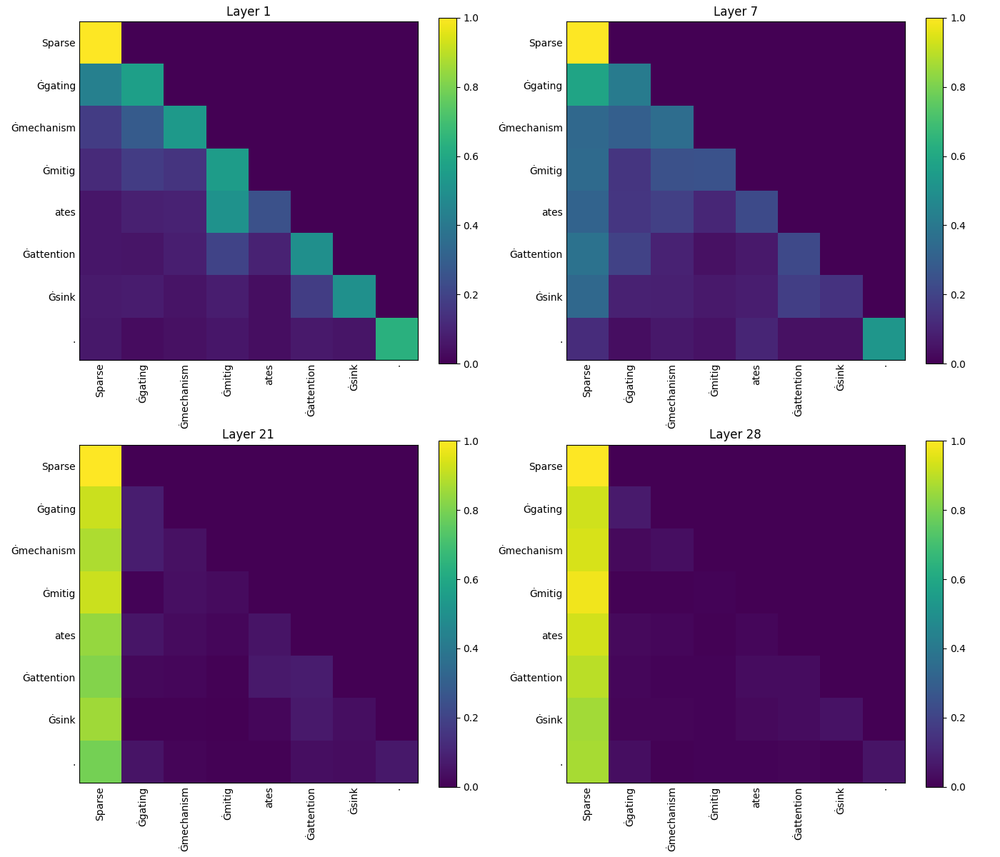
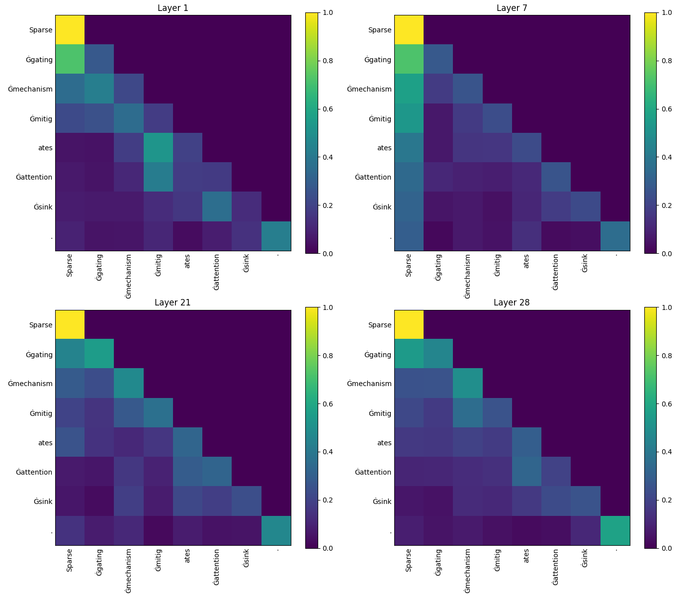
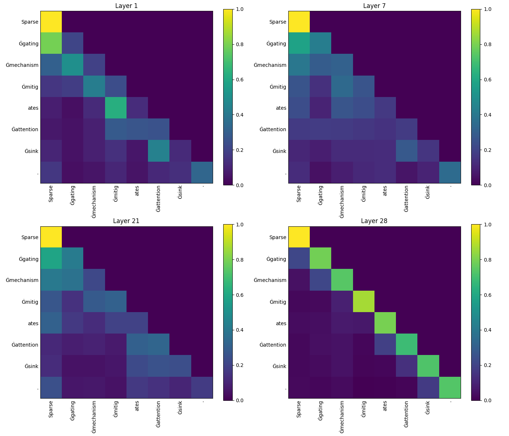

# Gated Attention: Implementation and Visualization

This repository contains the implementation of **gated attention** mechanisms based on [Qwen3](https://github.com/QwenLM/Qwen3) model architecture, along with tools for visualizing attention maps. Our modifications are based on findings from recent research that demonstrate how applying **sparse, head-specific gating after Scaled Dot-Product Attention (SDPA)** can significantly improve performance, training stability, and long-context generalization.

## 📚 Introduction

Gating mechanisms have long been a cornerstone of neural network design, enabling dynamic control over information flow. In this work, we focus on integrating and evaluating these mechanisms within standard softmax attention layers of transformer models.

We introduce a **query-dependent sparse gate** after the SDPA output (`G1`), which modulates each attention head independently using a sigmoid function. This simple yet effective change:

- Introduces **non-linearity** into the low-rank transformation formed by value and output projections.
- Enables **input-dependent sparsity**, preventing the "attention sink" phenomenon where early tokens dominate attention distributions.
- Improves **training stability**, allowing larger learning rates.
- Enhances **long-context extrapolation**, showing significant gains on benchmarks like RULER.

---

## 📦 Models

We provide variants of the Qwen3 model with different gating configurations:

- `baseline`: Standard attention without any gating.
- `gate_headwise`: Headwise gating applied after SDPA.
- `gate_elementwise`: Elementwise gating applied after SDPA.

All models are compatible with HuggingFace Transformers APIs.

---


## 🧪 Demo Usage

A demo script is included to load a trained model and visualize attention maps with gating enabled.

### Requirements

```bash
pip install transformers matplotlib numpy torch
```

### Run Demo

```bash
python demo.py
```

This will produce a file named `{model_name}_selected_layer_attention_maps.png`, showing attention maps for four key layers.

#### Attention Maps Comparison

Below are the attention maps from **Layer 1**, **Layer 7**, **Layer 21**, and **Layer 28** of three different model variants: `baseline`, `gate_headwise`, and `gate_elementwise`. These visualizations help illustrate how gating mechanisms affect attention patterns, especially in relation to the "attention sink" phenomenon.

In the **baseline** model, we observe a strong "attention sink" effect — the **first token** consistently receives disproportionately high attention scores across multiple layers. This indicates that the model overly relies on the initial token, potentially limiting its ability to distribute attention meaningfully across other positions.

##### Baseline Model  



> **Observation**: Strong diagonal dominance with significant focus on the first token (attention sink). This pattern persists across multiple layers.

##### Gate Headwise Model  



> **Observation**: Gating applied headwise reduces the attention sink effect. Attention becomes more distributed and context-dependent.

##### Gate Elementwise Model  



> **Observation**: Elementwise gating further enhances sparsity and selectivity in attention patterns, leading to cleaner and more structured attention maps.

---

## 📁 Repository Structure

```sh
qwen3-gated/
├── figs/                    # used figs in the paper
├── modeling_qwen3.py        # Modified Qwen3 model with gated attention
├── configuration_qwen3.py   # Model configuration with gating flags
├── demo.py                  # Simple demo for loading model and extracting 
└── README.md                # You are here
```

---

## 🔧 Implementation Details

The core changes to implement gated attention are found in the `Qwen3Attention` class in the provided code.

### 🧠 Gating Variants

We support two main types of gating:

#### 1. **Headwise Gating**

Each attention head has its own gate scalar.

```python
self.headwise_attn_output_gate = True
```

These options can be configured in the model config under:

```json
{
  "headwise_attn_output_gate": true,
  "elementwise_attn_output_gate": false
}
```

#### 2. **Elementwise Gating**

Each element of the attention output is modulated independently.

```python
self.elementwise_attn_output_gate = True
```

These options can be configured in the model config under:

```json
{
  "headwise_attn_output_gate": false,
  "elementwise_attn_output_gate": true
}
```

---


<!-- ## 📝 Citation

If you use this code or models in your research, please cite our paper:

```bibtex
@inproceedings{lin2025forgetting,
  title={Sparse Gating Mitigates Attention Sink and Enhances Long-Context Modeling},
  author={Lin, Yaxin and Xiao, Tianhe and Csordás, Róbert and Gu, Aohan and Zhang, Peng and Yang, Jian and Hua, Xinyi and Sun, Yu and Lin, Zhongkai and Liu, Hang and Tang, Yiyuan and Zhou, Minghai and Wang, Hongxia and Li, Junnan and Yuan, Zilong and Zhang, Yiren and Darcet, Théo and Chen, Bo and Cao, Qingqing and Lu, Haibo and Wang, Yizheng and Zhang, Kai and Zhang, Han and Wang, Shuming and Wu, Weiwei and Huang, Weikang and He, Yanyan and Xu, Jialin and Li, Xiaoyu and Zhao, Yue and Chen, Zhiyuan and Zhang, Yujie and Zhang, Xuefeng and Chen, Jing and Wang, Yanan and Wang, Jiaqi and Liu, Yuxiao and Liu, Chao and Liu, Yifan and Li, Meng and Zhu, Yunpeng and Jiang, Yufei and Li, Cheng and Zhang, Yuhao and Wang, Shuo and Zhang, Peng and Ma, Yuting and Wang, Xiaolong and Li, Yaxin and Zhang, Yaxin and Zhang, Peng and Zhang, Yiren and Zhang, Yujie and Zhang, Xuefeng and Zhang, Kai and Zhang, Han and Zhang, Yiren and Zhang, Yujie and Zhang, Xuefeng and Zhang, Kai and Zhang, Han},
  year={2025}
}
``` -->

## 📬 Contact

For questions or collaboration opportunities, feel free to reach out at <qzh11628@gmail.com>.